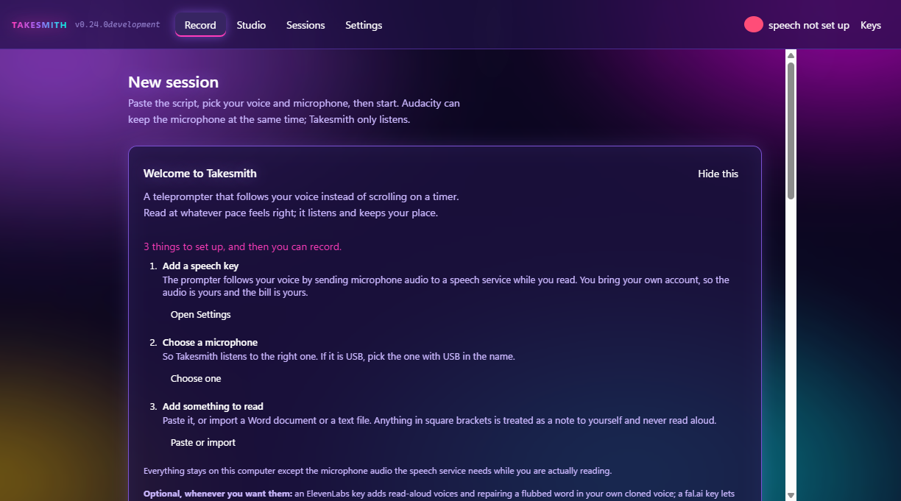
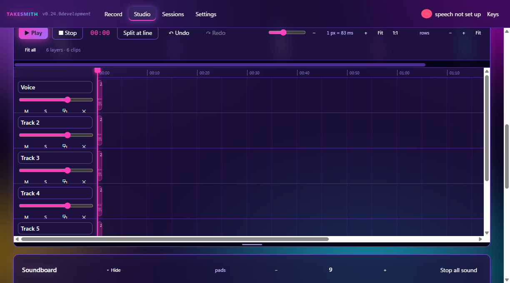
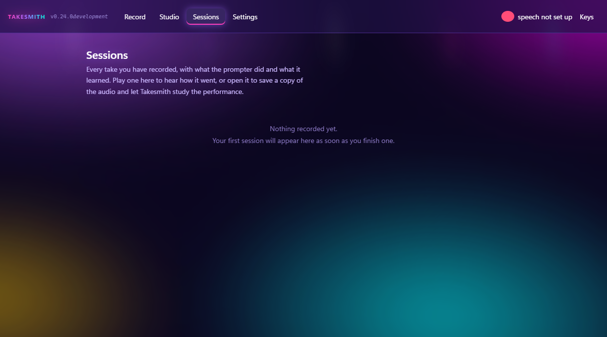
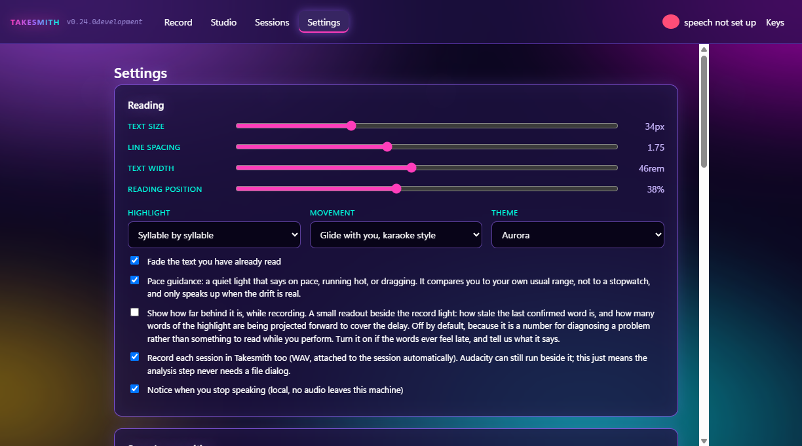

# Takesmith

### A teleprompter that follows you instead of making you follow it.

Takesmith is a local-first voice-following teleprompter and podcast studio built around a simple problem:

**People do not speak like scrolling text.**

Traditional teleprompters keep moving whether you are ready or not. Takesmith listens to what you are actually saying, keeps track of where you are in the script, waits when you stop, and helps you find your place again when you improvise, repeat yourself, or go off-script.

The goal is not to make a person sound like they are reading.

The goal is to let them speak naturally while the script keeps up.

## The prompter

* Follows your spoken words through a script in real time
* Highlights where you currently are
* Waits when you stop speaking
* Recovers when you repeat, skip, improvise, or restart a section
* Lets you pause, slow down, speed up, repeat, restart, and skip
* Provides runway words so you can see what is coming without chasing the screen
* Walk back through a paused take a sentence at a time, and record again from that point

## The studio

What starts as a read becomes a finished episode without leaving the app.

* A multi-layer timeline: lay music under a take, trim, split, fade and mix
* Anything you change while it is playing is heard while it is playing
* **Edit the video by selecting words in the transcript**
* See the camera while it records, and the picture plays with the audio on the timeline
* Video pickups with an alignment ghost, so a retake lines up with what is already there
* Guest cameras, and remote guests
* B-roll suggestions and poster frames
* An effects rack, running off the main thread so it never stalls the room
* Export to WAV or MP3

## Sessions

Every take is kept along with what happened during it. Nothing is thrown away because one sentence went wrong.

## Bring Your Own Keys

Takesmith is designed around **BYOK**, or Bring Your Own Key.

Voice recognition uses a user-provided **Deepgram API key**.

An **ElevenLabs key is optional** for AI voice features.

That means Takesmith does not need to quietly bundle someone else's expensive AI usage into a subscription just to make the core experience work.

## Why I built it

I wanted to record spoken work without having to choose between sounding natural and staying on script.

Most teleprompters solve that problem by asking the speaker to adapt to the machine.

I wanted the machine to adapt to the speaker.

That idea turned into Takesmith.

## Current status

Takesmith is under active development and testing. The build on this page is **0.24.0**.

The core project is kept in a private repository while the software continues to be developed. This repository is the public home for information, screenshots, development updates, and future release information.

**This repository does not contain the private Takesmith source code.**

The pictures here are photographed from the real application, by a build that runs itself with nobody in front of it, so the page can be kept honest release by release rather than whenever somebody remembers.

## Part of The Grey Zone

Takesmith is one of a growing collection of software, games, writing, and experiments built inside **The Grey Zone**.

https://thegreyzone.xyz

---

**Built by Greygray with AI collaboration openly included in the process.**

Human judgment stays in the driver's seat.
